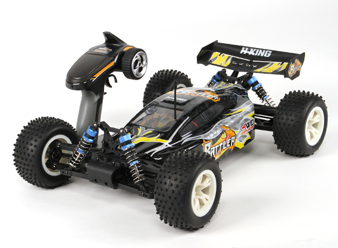
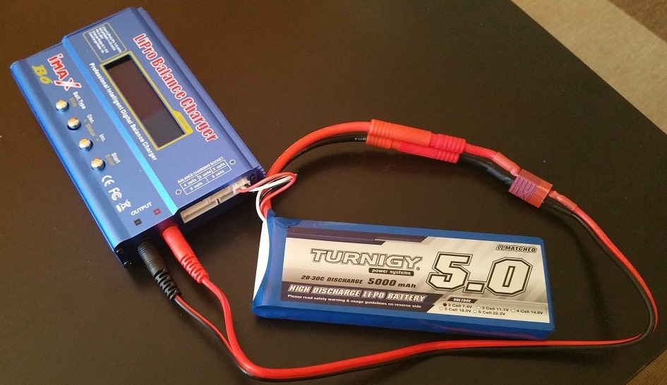

# Control y monitorización de drones terrestres - Página en construcción!

El objetivo del proyecto es sustituir el mecanismo de control de un dron terrestre (un coche RC), típicamente basado en un mando físico que emite las órdenes al coche por alguna tecnología de radio, por otro basado en una red de datos TCP/IP mediante el uso de una aplicación web y un mando de videojuegos. También se contemplan temas de monitorización del coche mediante la instalación en el mismo de una serie de sensores que permiten medir ciertos parámetros, como la velocidad o la temperatura ambiente. Para ello, se emplea una placa Arduino que sirve de puente entre el coche RC y la aplicación web.

**Un vistazo rápido del funcionamiento y componentes del proyecto en el siguiente vídeo: http://www.youtube.com/watch?v=hJ5HVmcTfEM**

## El proyecto

Algunas consideraciones importantes a tener en cuenta:

 * El proyecto se desarrolló en 2016, con tecnología hardware y software de ese año. Desde entonces no ha habido ninguna evolución del proycto, por lo que seguramente hoy en día existan tecnologías más efectivas que las empleadas en el proyecto en la actualidad. 
 * Mi campo no es la electrónica, ni las placas, ni los cableados, ni los voltajes. Cuando empecé con el proyecto era totalmente novato en estas cuestiones y tuve que dedicar una ingente cantidad de tiempo y disgustos a experimentar con estas cosas. El proyecto NO PRETENDE servir de buen ejemplo de estas tecnologías.
 * El objetivo del proyecto fue la **experimientación y el auto aprendizaje**. TAMPOCO PRETENDE servir de ejemplo de código fuente limpio, patrones de diseño, etc. De hecho, el único criterio a la hora de elegir tecnología para el desarrollo (ASP.NET, .NET Framework 4.5, WebMethods, jQuery) fue únicamente que era tecnología que me resultaba familiar.
 * Es un proyecto donde los componentes electrónicos empleados tienen un gran peso, y donde algunos o muchos de los componentes hardware empleados son muy complicados obtener hoy en día al estar descatalogados, anticuados, etc. Por lo tanto, es un proyecto muy dificilmente reproducible por algún interesado hoy en dia, al menos exactamente como fue concebido.
 * Por todo ello, es importante aclarar que este proyecto está publicado por si alguien quiere curiosear por el código, comprobar cómo se comunica el arduino con el coche RC, o cosas así. El proyecto no está ahora mismo en evolución, ni esta previsto lanzar futuras versiones ampliando funcionalidades o mejorando el código.

## Componentes hardware

En construcción

El coche seleccionado para el proyecto fue el modelo H.King Rattler 1/8 4WD Buggy, que se comercializa (o comercializaba) por la tienda HobbyKing. El mando de radio control se incluía en el pack de venta.

Si se levanta el chasis del coche algunos componentes del mismo que se pueden ver son:

 * **Batería**. No se incluye en el pack y fue adquirida a parte. Es una 9172 Turnigy 5000mAh 2S 20C Lipo Pack.
 
 * **Variador de velocidad**. Esta pieza, comúnmente conocido como ESC o speed controller, es el componente central del coche, y se conecta simultáneamente al motor del coche, a la batería, y al receiver. Originalmente era un Waterproof Esc de 40A, y soportaba baterías lipos de 2 o 3 células. Pero en pleno desarrollo del proyecto  el variador original del sufrió una avería, y tuvo que ser sustituido por otro HobbyWing eZRun compatible con el resto de componentes del coche.
 * **Motor**. Es de tipo 4 pole 540 size H.King 2700 KV.
 * **Receiver**. El receptor (receiver) es el puente de unión entre el mando de control y el resto de componentes del coche. Está conectado tanto al controlador de velocidad (ESC) como al servo de dirección, permitiendo de esta manera el control a distancia sobre la dirección y la potencia y sentido de desplazamiento del coche, respectivamente.
 * **Servo de dirección**. El servo de dirección, por último, que tiene una fuerza de 9kg. Está conectado únicamente al receptor, y su función es interpretar las órdenes que llegan del mando de control a través del receptor, y girar las ruedas delanteras del coche tantos grados como se le indique. De esta manera se controla la orientación del coche.

Para poder sustituir el mecanismo de control por radio del coche RC por otro basado en una red de datos TCP/IP, se realizaron las siguientes modificaciones sobre el diseño original:

* **Placa Arduino**. Para este proyeto se optó por usar una Arduino Yún, ya que esta placa permite trabajar fácilmente con señales electricas, y además este modelo en concreto aportaba una serie de capacidades añadidas (su procesador Atheros soporta una distribución Linux basada en OpenWrt llamada OpenWrt-Yun) que permitían dotar al coche de comunicación TCP/IP, tan necesaria para el proyecto. La función de la placa Arduino es la de sustitur el receptor (receiver) que, como se ha comentado, es el componente que recibe las órdenes del mando de control, y las transmite tanto al variador de velocidad (ESC) como al servo de dirección. Por tanto, con el nuevo montaje, hay que desconectar el receiver tanto del servo de dirección como del ESC, y conectar ambos componenetes a la placa Arduino a traves de cables Servo.
* **Sensores en la placa GY-80**. El coche no incorpora ningún sensor que permita la monitorización de su comportamiento. Es por ello que decidió usarse la placa GY-80 que incorpora en una misma placa 4 componentes: un magnetómetro (HMC5883L), un giroscopio (L3G4200D), un acelerómetro (ADXL345) y un barómetro (BMP085). Se conecta a la Arduin a través del bus I2C. Y, como se puede observar en el vídeo, en el montaje se sitúa sobre un protoboard. Hay que resaltar que el GY-80 no proporciona mediciones sobre la velocidad, únicamente sobre la aceleración sufrida. Para inferir la velocidad a partir de la aceleración se realiza una estimación mediante la "Regla del Trapecio", basada en obtener medidas periódicas.
* **Circuito de energía**. En el vídeo puede observarse que la placa Arduino se alimenta de una fuente de alimentación externa, lo cual es suficinte para una demo. Pero en un entorno real sería deseable prescindir de esa batería externa y alimentar la Arduino directamente de la propia batería del coche. Pero, para ello, habría que complicar un poco el montaje, ya que la Arduino Yún admite una entrada de 5V de potencia, mientras que la batería del proyecto proporciona 7.4 V de potencia. Además, es necesario garantizar una fuente de tensión constante para disminuir la posibilidad de dañar a la placa arduino debido a oscilaciones en los niveles de tensión. Para subsanar estos inconvenientes se ha optado por usar un regulador de voltaje LM 7805. Un regulador de voltaje es un dispositivo electrónico que se alimenta de una cantidad de tensión determinada y es capaz de entregar una cantidad menor y acondicionada para un equipo determinado.

## Componentes software

En construcción

**Panel de control y monitorización**. El panel de control y monitorización del coche en una página aspx que permite el control del coche a través de un gamepad o del propio panel, mediante la pulsación de varios botones. También muestra varios controles que muestran de forma gráfica algunos parametros del coche, como son la temperatura ambiente, la velocidad. Algunas consideraciones a tener en cuenta son las siguientes:
* Control del gamepad. Se hace uso de la Gamepad Api de HTML5. Está personalizado para un gamepad de prueba del que disponía por casa y que imita a los típicos gamepads de Playstation.
* Controles de medición. Se ha usado la librería SteelSeries Gauges para representar visualmente estos controles.
* Para la comunicación Ajax de la página con el servidor se ha empleado la tecnología WebMethods de ASP.NET

**Programación de la placa Arduino**. Dentro de la carpeta Arduino se encuentra el código de la placa. Básicamente, en la Arduino se levantan una serie de servicios web similares a REST que usan JSON para intercambiar datos, y que aceptan peticiones para contolar el coche o monitorizar su estado. Estos servicios a su vez traducen las órdenes recibidas y actúan sobre los servos/sensores del coche para realizar la acción solicitada.
